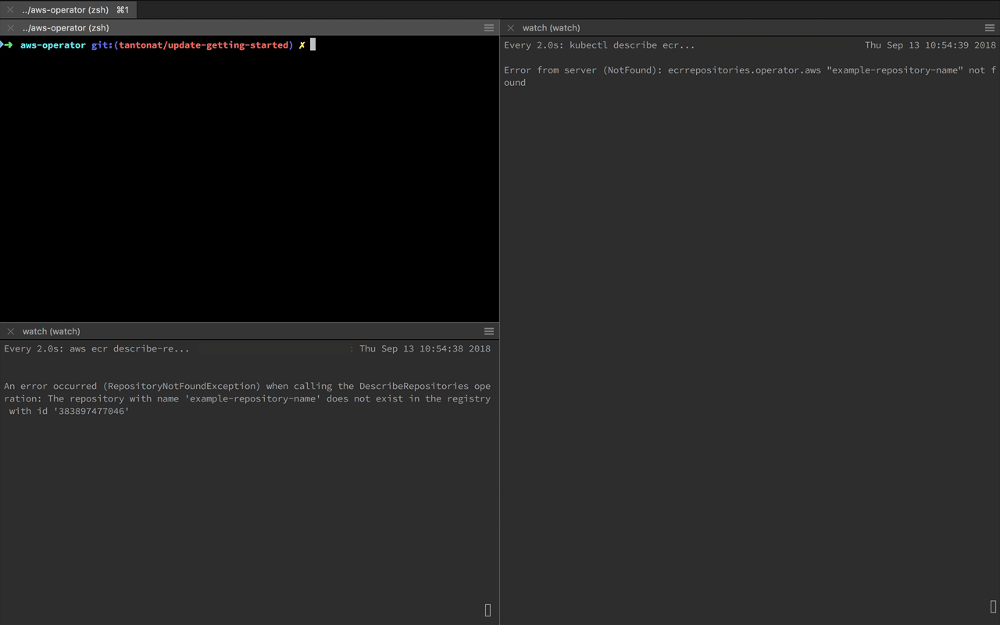

= AWS Service Operator

The AWS Service Operator allows you to manage AWS resources using
Kubernetes Custom Resource Definitions.

Using the AWS Service Operator enables a `gitops` workflow to drive your infrastructure to the desired state leveraging Kubernetes Custom Resource Definitions (CRD), the Kubernetes internal control loop, and AWS CloudFormation orchestration.  Read more about "operators" link:https://coreos.com/operators/[here].

== Prerequisites

To get started you will need

- a Kubernetes cluster running in AWS. Check out link:https://docs.aws.amazon.com/eks/latest/userguide/what-is-eks.html[EKS] or link:https://github.com/kubernetes/kops[kops] to get started
- link:https://kubernetes.io/docs/tasks/tools/install-kubectl/[kubectl]
- link:https://docs.aws.amazon.com/cli/latest/userguide/installing.html[awscli]

== Getting Started

Make sure your Kubernetes cluster is up and running and you've configured your awscli for the approriate account and region you'll be working in.

=== IAM permissions management

You will need to install an IAM management layer
such as `kube2iam`. This will allow you to use an AWS IAM role to manage a pod's
access to AWS resources.

To get started with `kube2iam` go link:https://github.com/jtblin/kube2iam[here] or check out the
link:https://github.com/helm/charts/tree/master/stable/kube2iam[helm chart]

The `aws-service-operator` runs as a pod in your Kubernetes cluster and listens for new `aws` type CRDs.
When a new CRD is created the operator will create the resource in AWS via CloudFormation and
create a Kubernetes `Service` for access within the cluster.

=== Create an IAM role for the `aws-service-operator`

 The `K8S_WORKER_NODE_IAM_ROLE_ARN` is the IAM role arn assigned to your kubernetes worker instances.

[source,shell]
aws cloudformation create-stack \
  --stack-name aws-service-operator-role \
  --capabilities CAPABILITY_NAMED_IAM \
  --template-body file://configs/aws-service-operator-role.yaml \
  --parameters \
    ParameterKey=WorkerArn,ParameterValue=<K8S_WORKER_NODE_IAM_ROLE_ARN>

Your resulting IAM role arn should look something like `arn:aws:iam::<ACCOUNT_ID>:role/aws-service-operator`

=== Deploy the aws-service-operator

Before applying these resources make sure to replace the following placeholders with the approriate information in `configs/aws-service-operator.yaml`

- `<ACCOUNT_ID>` - Your AWS Account ID
- `<REGION>` - The AWS Region you're working in
- `<CLUSTER_NAME>` - The name of your cluster
- `<BUCKET_NAME>` - (optional) The operator stores certain things in s3 create a bucket or provide an existing bucket for the operator to use `i.e. aws s3 mb s3://foobar`
- `<K8S_NAMESPACE>` - (optional) This will scope kubernetes API calls to a specific namespace. If used consider adding a namespace to the resources defined in `configs/aws-service-operator.yaml`

.1. Create the operator
[source,shell]
kubectl apply -f configs/aws-service-operator.yaml

.2. Create the CloudFormation templates (cft) used by the operator
[source,shell]
kubectl apply -f examples/cloudformationtemplates

.3. (optional) Follow the operator logs
[source,shell]
kubectl logs -f -n aws-service-operator deploy/aws-service-operator

.4. Create an ECR repository with the operator
[source,yaml]
kubectl apply -f examples/ecrrepository.yaml

The operator will communicate directly with CloudFormation to create the ECR repository using
the parameters you have passed in. If you'd like to see the progress you can
view the status directly via `kubectl`.

.5. Check the ecr resource in Kubernetes
[source,shell]
kubectl describe ecr example-repository-name

== Removing everything

If you would like to tear everything down - run the following commands.

*IMPORTANT* this will not remove anything you created with the AWS CLI (ECR repo for the operator itself, IAM roles etc.)

[source,shell]
kubectl delete ecr example-repository-name
kubectl get crd | grep ".operator.aws" | awk '{print $1}' | xargs kubectl delete crd
kubectl delete -f configs/aws-service-operator.yaml

== Developer Docs

link:development.adoc[Here]

= FAQ

What is the difference between aws-service-operator (this project) and link:https://github.com/awslabs/aws-servicebroker[aws-servicebroker]?::
  The operator approach is based on an active component that can react to changes and eventually will also support day 2 operations. See link:https://github.com/awslabs/aws-service-operator/issues/137[Issue #137] for more details, pull requests are most welcome.
